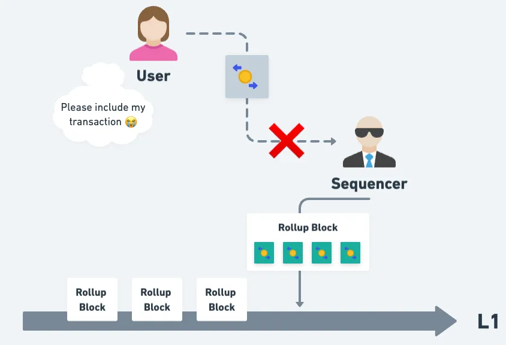

# Force Inclusion Mechanism

Force Inclusion Mechanism allows user to force include their transaction by interacting directly with the contracts on L1 instead of going through the L2 sequencer. Hence L2 sequencer won't be able to censor users unless the sequencer also tries to do censorship on L1.

Interested reader can read this (Chinese) article on [how Force Inlcusion works and how it is implemented on different L2s](https://medium.com/taipei-ethereum-meetup/rollup-force-inclusion-mechanism-and-implementations-overview-0853ded0dffa).

## Caveats

1. Force Inclusion guarnatees **"Inclusion"**, not **"Execution"**
   - meaning user can force include his transaction but the result of execution might not be what he is expecting, e.g., the transaction might fail
2. The handoff problem: check out this great writeup about the limitations of Force Inclusion mechanism [here](https://x.com/init4tech/status/1831030650314559689)

___

## Different L2, different implementation

Implementation of Force Inclusion Mechanism varies from one L2 to another. Here are some examples:

### How to make the force inclusion transaction request?
- Optimism: user takes parameters of a normal Optimism transaction and sends them to the L1 contract to make the request
- Arbitrum: user takes a normal signed Arbitrum transaction and sends it to the L1 contract to make the request

### Does "who interacts with the L1 (Force Inclusion) contract" matter?
- Optimism: user needs to interact with the L1 contract himself
- Arbitrum: a third party can interact with the L1 contract on user's behalf

### How is the gas cost of the force inclusion transaction paid?
- Optimism: gas cost of the force inclusion transaction is paid on L1
- Arbitrum: gas cost of the force inclusion transaction is paid on Arbitrum, just like a normal Arbitrum transaction

### Does user need extra steps to complete the force inclusion?
- Optimism: user does not need extra steps to complete the force inclusion
- Arbitrum: user needs to complete the force inclusion manually after a 24 hour delay, if sequencer chooses to omit the force inclusion request

___

## Force Inclusion on Optimism

Check out [Force Inclusion on Optimism](./optimism-force-inclusion.md)

___

## Force Inclusion on Arbitrum

Check out [Force Inclusion on Arbitrum](./arbitrum-force-inclusion.md)

___

After you finish reading the above, you can check out the [Uncensored SDK](../uncensored-sdk/overview.md) to see how you can implement Force Inclusion Mechanism in your wallet or the [Uncensored Front End](../uncensored-front-end/overview.md) to see how to use the frontend to force include your transaction.
