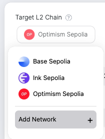
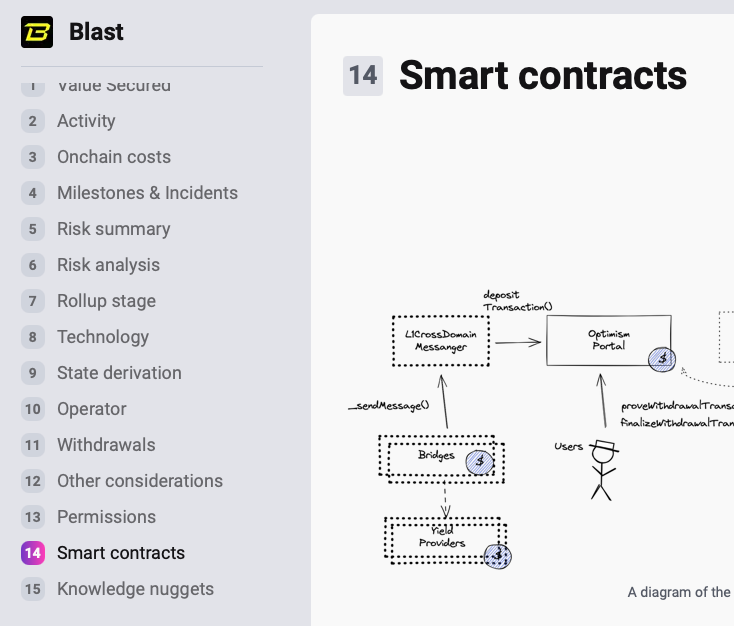
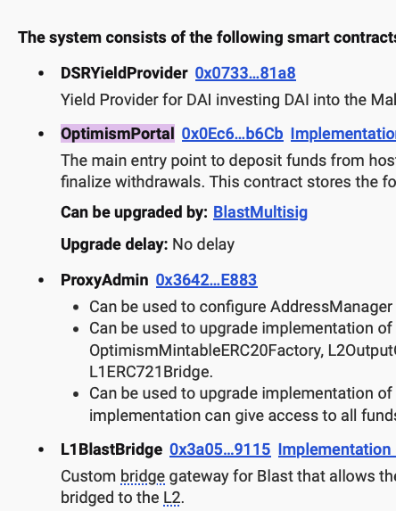
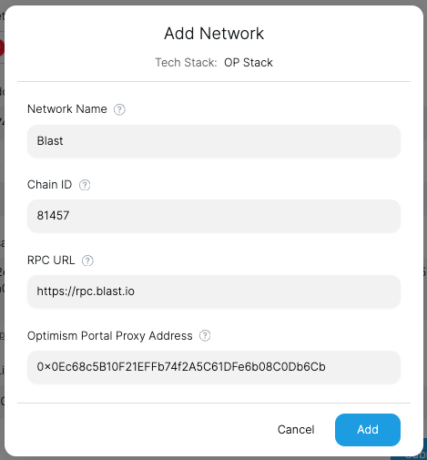

# Uncensored Frontend - Custom Network

If you don't find the chain you want on the Uncensored Frontend, you can add it as a custom network.

**NOTE: Only Optimism Stack Chains are supported right now**

After you click the chain button, you will see a dropdown menu of supported chains. Click `Add Network` to add a custom network.

In the `Add Network` modal, you need to fill in the following fields:
- `Network Name`: The name of the chain you want to add.
- `Chain ID`: The chain ID of the chain you want to add.
- `Portal Proxy Address`: The address of the L1 (Optimism Portal) contract to make the force inclusion request.
  - For example, you can find the `Portal Proxy Address` of Blast from their [docs](https://docs.blast.io/building/contracts). Look for the address of `OptimismPortal`.
  - Or check out L2Beat's detailed documentation of each L2 chain and look for `OptimismPortal` in the `Smart Contracts` section.
    - 
    - 
- `RPC URL`: The RPC URL of the chain you want to add.

After you fill in the fields, click `Add` to add the custom network.

